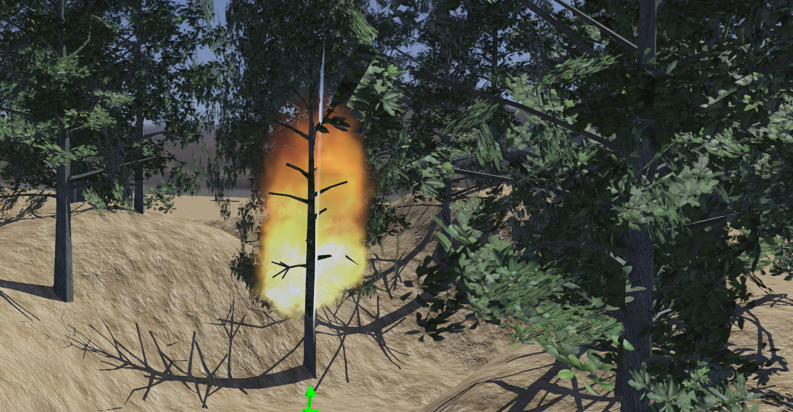

# Forest Firefighters

This simulation is current work in progress.
It will feature the simulation of a small forest wildfire and a few firefighter robots: a couple of drones and legged robots equipped with cameras.
Users will be able to run the wildfire simulation and program the behavior of the robot to fight the fire.
They will also be able to improve the models of the robot and even design new ones.

This video shows a wildfire propagating into one tree until the tree is completely burnt:

https://user-images.githubusercontent.com/1264964/130241653-c0fd0966-1ce2-41d1-aeae-452a187b95be.mp4
