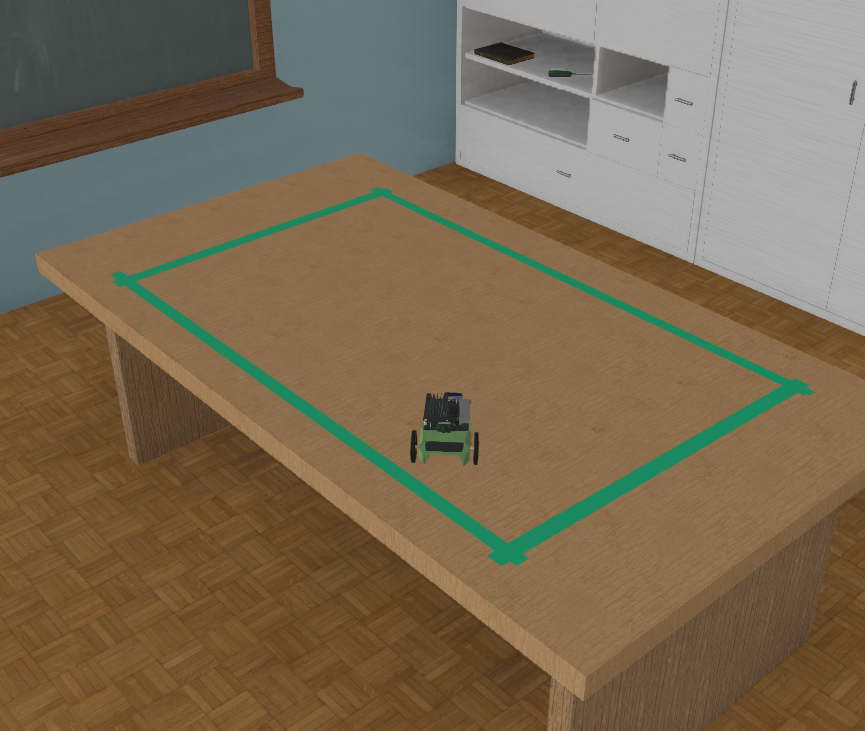

# NVIDIA JetBot collision avoidance

In this example, the [JetBot](https://www.cyberbotics.com/doc/guide/jetbot) robot performs collision avoidance based on a PyTorch ResNet-18 convolutional neural network (CNN).
A pre-trained model is provided to be used directly with the Python `jetbot_collision_avoidance` controller.
However, a Python `jetbot_collect_data` controller is also provided to build a dataset and computer the PyTorch trained model.

## What is included

The code consists of two controllers:
* [`jetbot_collision_avoidance`](controllers/jetbot_collision_avoidance/jetbot_collision_avoidance.py): this is the default controller that uses the trained CNN model to control the JetBot robot and run the collision avoidance AI model. A pre-trained model is included that can be used directly. To manually train the model, please set the `JetBot.controller` to `jetbot_collect_data` controller and follow the instructions printed in the Webots console.
* [`jetbot_collect_data`](controllers/jetbot_collect_data/jetbot_collect_data.py): this controller helps creating a simple dataset of Camera images and training the CNN. Images should be labeled "free" or "blocked" depending if the robot can still go forward from the current position or not by pressing the keys 'F' or 'B'. To train the model, press the key 'C'.

Additionally, a [Python library](libraries/jetbot_python_control.py) is included providing basic motion control.

The Python code used in this example replicates the collision avoidance code provided by the Jupyter notebooks from the [NVIDIA-AI-IOT repository](https://github.com/NVIDIA-AI-IOT/jetbot/tree/master/notebooks/collision_avoidance) .

## How to run this example

Download this folder and open the `jetbot_collision_avoidance.wbt` world in Webots.
